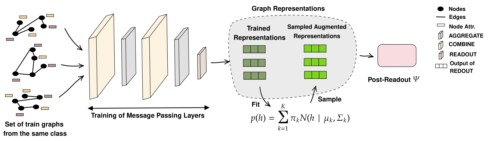

# Graph Neural Network Generalization With Gaussian Mixture Model Based Augmentation (GRATIN)

**_[ICML 2025]_**  This repository contains the Pytorch implementation code of our paper accepted to the *Forty-second International Conference on Machine Learning (ICML 2025).*  
📄 **Read the paper on OpenReview → [Graph Neural Network Generalization With Gaussian Mixture Model Based Augmentation](https://openreview.net/forum?id=JCKkum1Qye)**

## 👥 Authors
Yassine Abbahaddou, Fragkiskos D. Malliaros  , Johannes F. Lutzeyer, Amine M. Aboussalah  , Michalis Vazirgiannis

---


## ✂️ Abstract
*Graph Neural Networks (GNNs) have shown great promise in tasks like node and graph classification, but they often struggle to generalize, particularly to unseen or out-of-distribution (OOD) data. These challenges are exacerbated when training data is limited in size or diversity. To address these issues, we introduce a theoretical framework using Rademacher complexity to compute a regret bound on the generalization error and then characterize the effect of data augmentation. This framework informs the design of GRATIN, an efficient graph data augmentation algorithm leveraging the capability of Gaussian Mixture Models (GMMs) to approximate any distribution. Our approach not only outperforms existing augmentation techniques in terms of generalization but also offers improved time complexity, making it highly suitable for real-world applications.*  

---
## 🖼️ Method Diagram


---
## 🚀 Run the Code
Follow these steps to run GRATIN augmentation method:

```bash
# 1. Clone the repo and jump into the source directory
git clone https://github.com/abbahaddou/GRATIN.git
cd GRATIN/Code

# 2. Step 1:  Training the Message Passing Layer with No Augmentations
python first_train.py \
    --data IMDB-BINARY \
    --model GCN

# 3. Step 2: Augment Graphs, Retrain the Post‑Readout Function, and Evaluate
python fit_GMM.py \
    --data IMDB-BINARY \
    --model GCN

# You can also run the code on a different dataset/backbone
# python first_train.py --data PROTEINS --model GIN
# python fit_GMM.py --data PROTEINS --model GIN
```
## Citing
If you find this work interesting or helpful for your research, please consider citing this paper

```bibtex
@inproceedings{
abbahaddou2025graph,
title={Graph Neural Network Generalization With Gaussian Mixture Model Based Augmentation},
author={Yassine ABBAHADDOU and Fragkiskos D. Malliaros and Johannes F. Lutzeyer and Amine M. Aboussalah and Michalis Vazirgiannis},
booktitle={Forty-second International Conference on Machine Learning},
year={2025},
url={https://openreview.net/forum?id=JCKkum1Qye}
}
```

## ✉️ Contact

Have questions or want to collaborate? Feel free to reach out to **Yassine Abbahaddou** at <yassine.abbahaddou@polytechnique.edu> 
